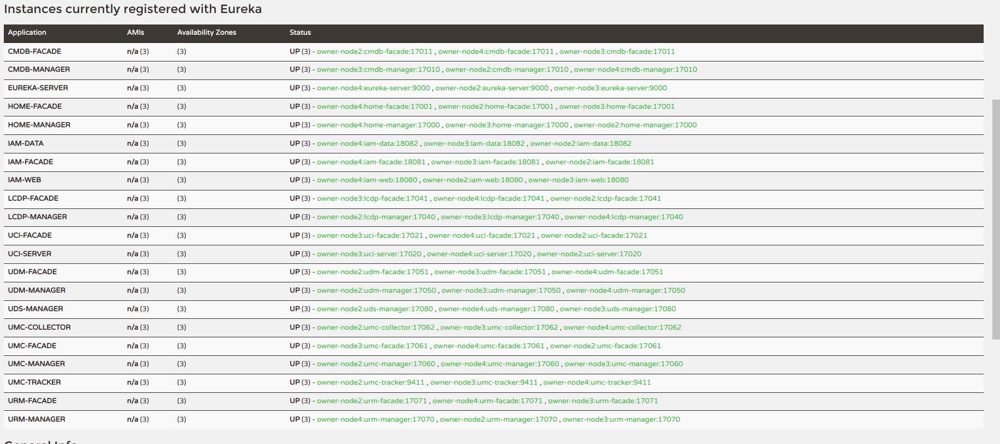

# XCloud DoPaaS


[中文文档](README_CN.md) | English version goes [here](README.md)

<b style="color:red">Notes: Currently, the fully distributed version is being incubation, so it is not a good choice to run directly in the production environment !</b>


## One stop solution of PaaS platform based on DevSecOps
> Based on SpringCloud/Docker/ServiceMesh(istio), the main modules are: unified asset management center (Cmdb), unified continuous delivery center (distributed compilation CI/CD), Iam Certification Center(Rbac/Oidc/[Saml2])), unified monitoring center (SBA/Zipkin/Promethous), unified configuration center, unified operation center (Elasticjob/Spark/Flink/MR), unified Document Center (Swagger/Rap), unified development center (Lcdp/Autogen), unified private object storage management, unified library management (Git/Nexus(Maven/Image)), Shell-Cli, multiple tool chains (Hdfs/HBase/Phoenix/OSS), instant messaging, lightweight risk control, etc

[](https://travis-ci.org/wl4g/xcloud-dopaas)

[](https://github.com/wl4g/xcloud-dopaas)
[](https://github.com/wl4g/xcloud-dopaas)
[](https://github.com/wl4g/xcloud-dopaas)
[](https://github.com/wl4g/xcloud-dopaas)
[](https://github.com/wl4g/xcloud-dopaas)
[](https://github.com/wl4g/xcloud-dopaas)
[](https://github.com/wl4g/xcloud-dopaas)
[](https://shang.qq.com/wpa/qunwpa?idkey=0343b06591d19188d86dc078912adfc5c40f023c8ec5a0d1eda5bdfc35ab40d0)
[](https://github.com/wl4g/xcloud-dopaas)
[](https://gitee.com/wl4g/xcloud-dopaas)
[](https://gitee.com/wl4g/xcloud-dopaas)
[](https://gitee.com/wl4g/xcloud-dopaas)


## 1. Development and runtime on technology stack(primary)
> This project is mainly based on the development of SpringBoot/Cloud/Dubbo, which supports the operation of traditional monomer (`standalone`) mode and fully distributed micro service (`cluster`) mode. The source structure is carefully designed as &nbsp;<b>It's both a platform and a framework demonstration</b>.

- Required dependencies:
Spring Boot:2.3 +  
Spring Cloud:Hoxton.x +  
Eureka:1.10 +  
Zipkin:2.15 +  
Jdk:8 +  
Maven:3.5 +  
Mysql:5.6 +  
- Optional dependencies:  
Kafka:2.3.1 +  
Zookeeper:3.6.0 +  
DockerCE:18.06 +  
CoreDNS:1.7.0 +  
MinIO:latest  
Elasticsearch(EFK):6.2.3 +  
Shardingsphere-Elasticjob:3.0.0 +  

- [Developments Guide](README_DEVEL_CN.md)


### 2.1 OneStop auto deployment
This method is applicable to the rapid deployment of regular hosts (non container). The deployment script will automatically detect the installation, including jdk/nginx/git/maven/node/eureka/zookeeper and all springboot apps, but not including redis/redis cluster(one of the options) and Mysql, which need to be manually installed.

```
bash -c "$(curl -L https://raw.githubusercontent.com/wl4g/xcloud-dopaas/master/script/deploy/deploy-boot.sh)"
# or
bash -c "$(curl -L https://gitee.com/wl4g/xcloud-dopaas/raw/master/script/deploy/deploy-boot.sh)"
```
- Please pay attention to modify [`deploy-env.sh`](script/deploy/deploy-env.sh) custom environment configuration according to the script prompt, and then re execute [`./deploy-boot.sh`](script/deploy/deploy-boot.sh). Please wait about 8-20 minutes patiently for the deployment from source code compilation (because the first time the code and dependency library will be slow to download. If you need to redeploy, you can set the `export buildForcedOnPullUpToDate=true` or `export deployFrontendSkip=true` to skip backend compilation and frontend compilation to accelerate)

- Before deployment, check whether nginx / zookeeper / Eureka has been installed on the target host. If so, it is recommended to stop first, because automatic deployment will also avoid conflicts

Cluster management tools:  
[`./dopaas-ctl.sh`](script/deploy/dopaas-ctl.sh)
```
Usage: {start-all|stop-all|restart-all|status-all|<appName> <start|stop|restart|status>}
    start-all    Start all remote nodes apps.
     stop-all    Stop all remote nodes apps.
  restart-all    Restart all remote nodes apps.
   status-all    Query status all remote nodes apps.
    <appName> <start|stop|restart|status>   for example: {cmdb-facade restart}
        Restart only the cmdb-facade application of all remote nodes,
        The optionals are: zookeeper/eureka-server/iam-web/iam-facade/iam-data/cmdb-facade/cmdb-manager/... etc.
```


Server specs requirements:

| Runtime Mode | Min requirements | Description |
| ---- | ---- | ---- |
| cluster | CentOS7+ / Ubuntu18+ (4C+8G+) | Only pseudo distributed clusters can be deployed when there is only one host |
| standalone | 2C+4G+ | Monomer application |


### 2.2 Manual compilation and build
It is suitable for build secondary development environment

#### 2.2.1 Editing .m2/settings.xml
```xml
<mirror>
    <id>nexus-aliyun</id>
    <mirrorOf>central</mirrorOf>
    <name>Nexus aliyun</name>
    <url>http://maven.aliyun.com/nexus/content/groups/public<url>
</mirror>
```

#### 2.2.2 Backend compiling
> Compile according to the order of project dependency. The `mvn -P` options are: `springExecJar` (packaged as a single executable jar) and `mvnAssTar` (packaged as a general software release package), default. 

```
git clone https://github.com/wl4g/xcloud-component.git # Relatively new upstream (recommended)
# git clone https://gitee.com/wl4g/xcloud-component.git # or
mvn -f xcloud-component -U clean install -DskipTests -T 2C

git clone https://github.com/wl4g/xcloud-iam.git # Relatively new upstream (recommended)
# git clone https://gitee.com/wl4g/xcloud-iam.git # or
mvn -f xcloud-iam -U clean install -DskipTests -T 2C

git clone https://github.com/wl4g/xcloud-dopaas.git # Relatively new upstream (recommended)
# git clone https://gitee.com/wl4g/xcloud-dopaas.git # or
mvn -f xcloud-dopaas -U clean install -DskipTests -T 2C
```

#### 2.2.3 Frontend compiling
```
git clone https://github.com/wl4g/xcloud-dopaas-view.git # Relatively new upstream (recommended)
or git clone https://gitee.com/wl4g/xcloud-dopaas-view.git
npm run dev # Development debugging
npm run build # Production building
```

### 2.3 Init DB: first, prepare a MySQL5.6+ instance and create a database named `dopaas`(utf8/utf8)_bin), and then [Init DB sql](../../../xcloud-dopaas-db).  
> Notes: the SQL script should correspond to the source code version. We will update it regularly. It is recommended to use the latest version

### 2.4 Configure DNS resolutio(C:\Windows\System32\drivers\etc or vim /etc/hosts)  
[Standalone mode resolution example](dns/hosts.standalone.tpl)  
[Cluster mode resolution example](dns/hosts.cluster.tpl)  
> Note: the domain names used for external services in different environments should correspond to `sys_cluster_config.extranet_base_uri` table  

### 2.5 Quickly build a redis cluster/docker(or self built)
[https://github.com/wl4g/docker-redis-cluster](https://github.com/wl4g/docker-redis-cluster) or   
[https://gitee.com/wl4g/docker-redis-cluster](https://github.com/wl4g/docker-redis-cluster)  

### 2.6 Launch and testing access (chrome recommended)
Notes：  
a. There is no need to specify any JVM args when trying to start (the default configuration is used). For example, only the configuration of `dev` environment will be activated by default;  
b. Whether it is `standalone` mode or `cluster` mode, it can correspond to four environments respectively (`dev`/`fat`/`uat`/`pro`).

#### 2.6.1 Starting for `standalone` mode.
Just run the following bootstrap classes:

```
com.wl4g.StandaloneDopaas  
com.wl4g.StandaloneIam  
```

#### 2.6.2 Starting for `cluster` mode.
Run the following bootstrap classes:

```
com.wl4g.EurekaServer  
com.wl4g.IamWeb  
com.wl4g.IamFacade  
com.wl4g.IamData  
com.wl4g.CmdbFacade  
com.wl4g.CmdbManager  
com.wl4g.HomeFacade  
com.wl4g.HomeManager  
com.wl4g.LcdpFacade  
com.wl4g.LcdpManager  
com.wl4g.UciFacade  
com.wl4g.UciServer  
com.wl4g.UdmFacade  
com.wl4g.UdmManager  
com.wl4g.UdsFacade  
com.wl4g.UdsManager 
com.wl4g.UmcFacade 
com.wl4g.UmcManager  
com.wl4g.UmcTracker 
com.wl4g.UmcCollector 
com.wl4g.UosFacade  
com.wl4g.UosManager  
com.wl4g.UrmFacade  
com.wl4g.UrmManager  
```

#### 2.6.3 Testing access (chrome recommended)
> http://wl4g.debug &nbsp;&nbsp; Default account password: root/wl4g.com

### 2.7 Deployed successful screenshot:
> Tips: the screenshot may be slightly different due to the version evolution, if you have any questions, please join the communication group (see the end section)


- [More shots](shots/)


## 3. Submodule documents
- [UCI](../../blob/master/xcloud-dopaas-uci/README.md)  Unified Continuous Integration Service(CI/CD)
- [UMC](../../blob/master/xcloud-dopaas-umc/README.md)  Unified Monitoring and Operation Center(applications healthing, tracking, alarming, ELK log analysis, etc)
- [URM](../../blob/master/xcloud-dopaas-urm/README.md)  Unified Repository Management(source repo/build repo/image repo)
- [UCM](../../blob/master/xcloud-dopaas-ucm/README.md)  Unified Config Management(Online configuration of hot updates such as dataSource, redisClient, etc)
- [CMDB](../../blob/master/xcloud-dopaas-cmdb/README.md)  Configuration Management Database(hosts, applications, secretKeys, auditing, DNS zone resoluting, etc)
- [UDM](../../blob/master/xcloud-dopaas-udm/README.md)  Unified Document Management(Online APIs/swagger documents, etc)
- [LCDP](../../blob/master/xcloud-dopaas-lcdp/README_CN.md) Low Code Development Platform(Automatic generate of multi language/architecture complete projects (e.g springcloud/dubbo/golang/python/vue/angularjs, etc), WebIDE, and various developer tool chains, etc)
- [UDS](../../blob/master/xcloud-dopaas-uds/README.md)  Unified distributed scheduling control center, such as elasticjob/spark/flink task, etc.
- [UOS](../../blob/master/xcloud-dopaas-uos/README.md)  Unified object storage services, based on springcloud development support NativeFS, HDFS, Aliyun OSS, AWS S3, GlusterFS, etc
- [UIM](../../blob/master/xcloud-dopaas-uim/README.md)  Unified instant messaging service, convenient for project personnel to communicate in time, safe distribution of internal data.


## 4. Other related apps and components documents
- [SHELL](xcloud-shell/README.md)            Shell Cli, adding a hbase-shell-like console to your app
- [IAM](xcloud-iam/README.md)                Unified identity and access management services, support SSO/CAS/oauth2/opensaml etc, It also supports multiple deployment modes(local/cluster/gateway)
- [Gateway](xcloud-gateway/README.md)        Enterprise microservice gateway based on spring cloud gateway, Can integrate with CI to realize Canary deployment.


## 5. Communicate, feedback and contribute?
- Click add to group [](https://shang.qq.com/wpa/qunwpa?idkey=0343b06591d19188d86dc078912adfc5c40f023c8ec5a0d1eda5bdfc35ab40d0)
- 
- GitHub: https://github.com/wl4g/xcloud-dopaas
- OS China: https://gitee.com/wl4g/xcloud-dopaas
- No matter how strong a person's personal ability is, he can't defeat a team. He hopes that his brothers and sisters can support him and contribute some of his own code to improve it together (^_^).

[Share Code?](https://www.cnblogs.com/wenber/p/3630921.html)