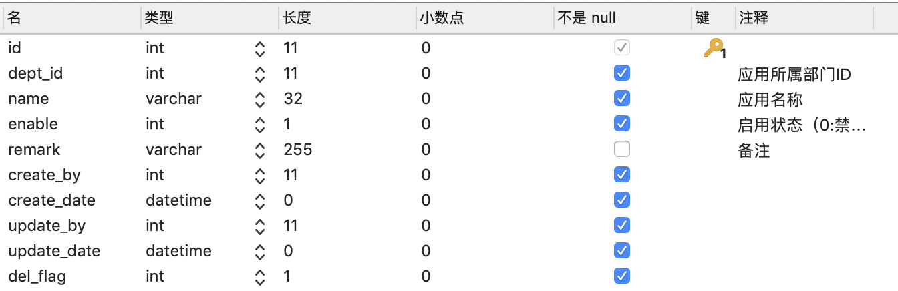
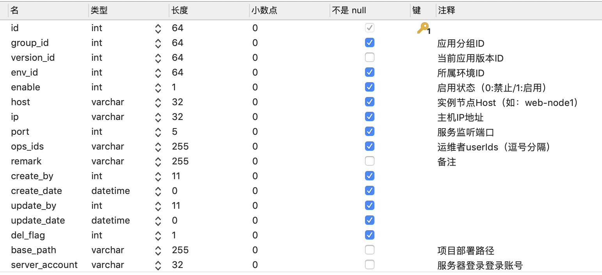
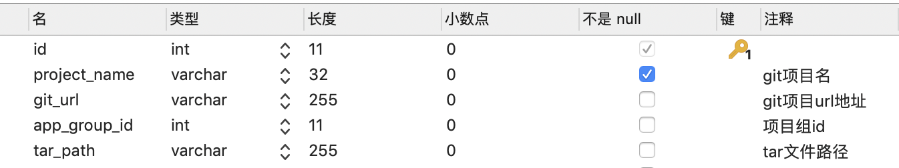
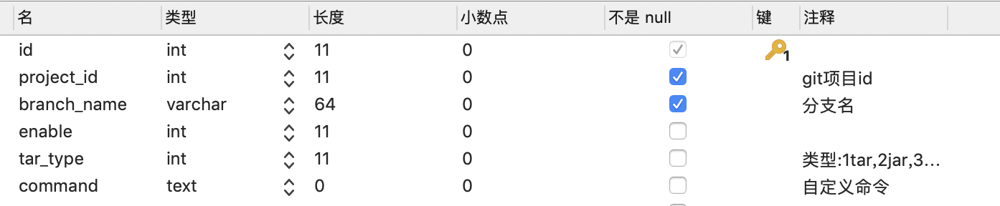
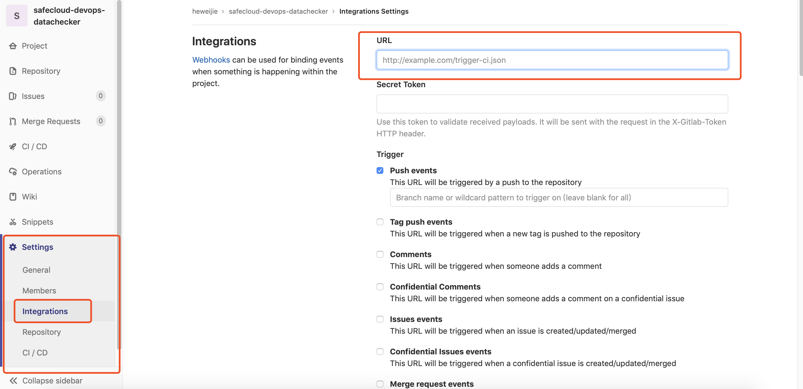

# UCI (Unified Continuous Integration Service)
> 统一持续集成交付服务

English version goes [here](README.md).

# 快速开始

## 源码编译
```
cd dopaas-ci
mvn clean install -DskipTests 
```

## 配置

### 配置文件
配置在application-test.yml

- git-username是登录git的账号
- git-password是登录git的密码
- cipher-key是用来加解密私钥的
```
# Deploy git configuration.
deploy:
  git-username: heweijie
  git-password: hwj13535248668
  cipher-key: 03DE18C2FC4E605F
```

### 数据库
数据库在dopaas
- app_group表

- instance表

- project表

- trigger表

- trigger_detail表


## 启动
可当作spring boot项目启动
sc ci start

## 控制台 

#### 进入控制台
```
sc ci shell
```
#### 控制台命令
- 查找实例id
```
list -a 项目名 -e 环境名 -r 正则表达式
```
- 部署项目
```
deploy -a 项目名 -I 实例id -b 分支名
实例id可多个，用","分割
例如：
deploy -a datachecker -I 64 -b master
```
- 过程中支持Ctrl+C强制退出


##钩子配置 
- 先去数据库把必要配置配好
- 到gitlab修改相关配置
```
到对应项目下的setting-->Integrations
设置URL：如：http://localhost:8080/ci/hook
勾选Push events
点击 Add webhook 保存
```



