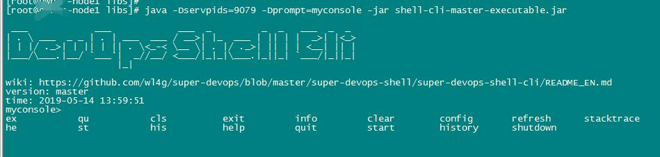
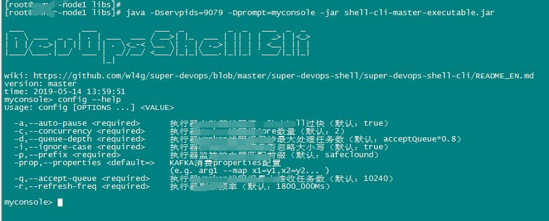

Shell-cli is an open source command-line tool based on spring cloud service, which is similar to the way spark-shell works.

[中文说明/中文文档](README_CN.md)

# Quick start

## Source code compilation
```
cd super-devops-shell
mvn clean install -DskipTests 
```

### Way1
(For client mode, usually temporarily used to connect application services)
Specify the port of the service, and then run directly as a client:

```
java -Dservpoint=10.0.0.160:60120 -Dtimeout=5000 -jar shell-cli-master-executable.jar
```
	
In the above command -Dservpoint=10.0.0.160:60120 indicates the Spring Cloud service 
listening address and port to connect to.

### Way2
(For local mode, usually used as a built-in console for application services)
Specify the PID list of the service, then run directly as the client, where shell-cli automatically 
scans the ports that match all the locally monitored ports of the PID process (default matching 
range 60100-60200)

```
java -Dservpids=19767,32374 -Dprompt=console -Dtimeout=5000 -Ddebug -jar shell-cli-master-executable.jar 
```

In the above command, -Dservpids represents a list of process numbers for the SpringCloud service to be connected,
which automatically finds the port of the service locally based on PIDs and establishes the connection.
If the port of the PIDs server is not reported to have been found (usually this error is not reported), you can try
to add the -Ddebug parameter debugging, or directly use [Way1](#Way1) (-Dservpoint) to display the specified service
endpoint. Where -Dprompt is used to set the command line prompt of the shell console, -Dtimeout specifies the time-out 
for waiting results to return (Default:10_000ms).

## Features
- Press TAB key to complete automatically
- Ctrl+A cursor jumps to the beginning of the line, Ctrl+E cursor jumps to the end of the line, Ctrl+C exits the console (follow GNU)


## Built-in commands:
- clear/cls    Cleaning console
- exit/ex/quit/qu    Exit console
- history/his    View the history command (persistent file: $USER_HOME/.devops/shell/history)
- stacktrace/st    View stack information for the last exception (if any)
- help/he    Use help, such as: help/help sumTest/sumTest --help/sumTest --he/ where sumTest is a summation test command


## Custom commands

[For perfect example](super-devops-shell-example/src/main/java/com/wl4g/devops/shell/exporter/ExampleExporter.java)
	