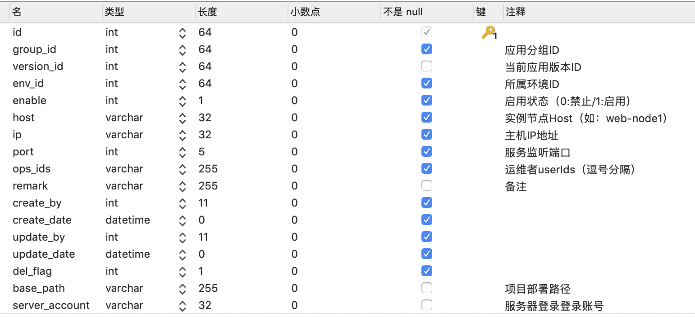
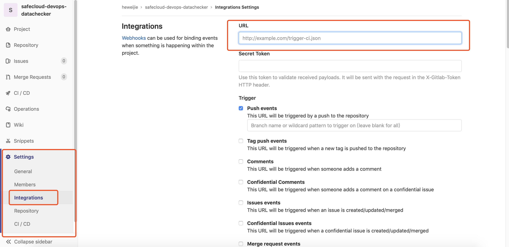

# UCI (Unified Continuous Integration Service)
> Continuous integration and continuous build delivery

[中文文档](README_CN.md)

## Quick start

### Source code compilation
```
cd xcloud-dopaas-ci
mvn clean install -DskipTests 
```

### configuration

### configuration file
config on application-test.yml

- git-username is the account to log in to Git
- git-password is the password to log on to Git
- cipher-key is used to encrypt and decrypt private keys
```
# Deploy git configuration.
deploy:
  git-username: heweijie
  git-password: hwj13535248668
  cipher-key: 03DE18C2FC4E605F
```

#### database
The database is in "dopaas"
- app_group

- instance

- project

- trigger

- trigger_detail


## Start
Start as a spring boot project
sc ci start

## Console 

#### start Console
```
sc ci shell
```
#### Console command
- Find instance ID
```
list -a <appName> -e <environment> -r<regular expression>
```
- deploy
```
deploy -a appName -I instanceId -b branchName
Instance IDS can be multiple, partitioned with ",".
For Examole：
deploy -a datachecker -I 64 -b master
```
- Support Ctrl+C forced exit in process


### Hook configuration 
- Go to the database first and match the necessary configurations
- Modify the configuration to gitlab
```
Setting to the corresponding project - > Integrations
Set the URL: for example: http://localhost:8080/ci/hook
Check Push events
Click Add webhook to save
```



